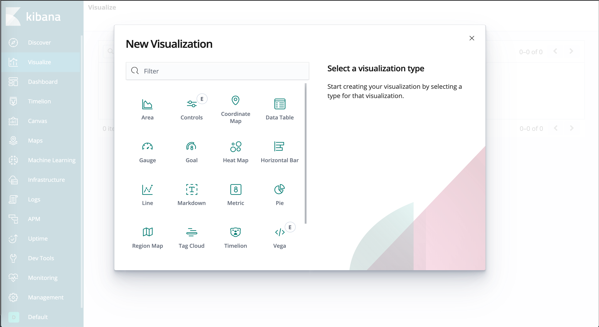
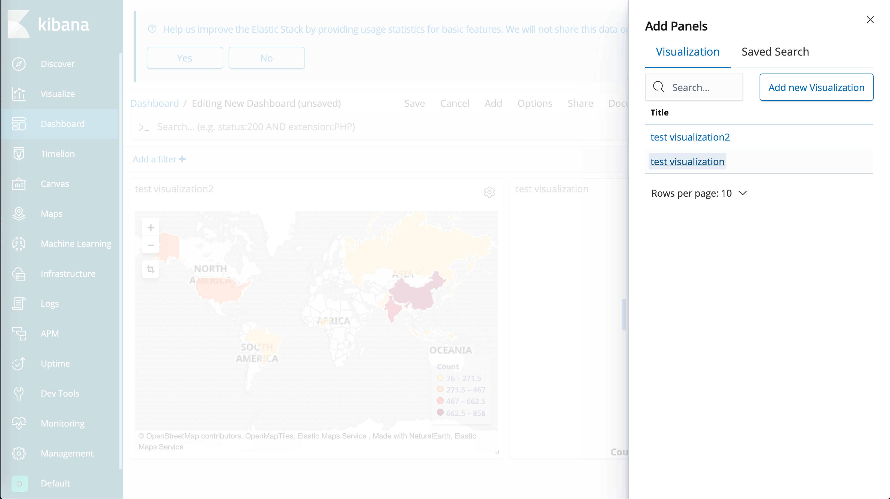

# Elastic Stack Tutorial
김종민님의 웨비나, 박상헌님의 ELK 튜토리얼, 허민석님의 깃헙 자료를 활용하여 만든 엘라스틱 스택 튜토리얼입니다.

## Product 버전
* CentOS 7.x
* Elastic Stack 6.7.0

## Tutorial 준비
- CentOS 7.x가 설치된 RAM 8GB 이상의 계정 이름이 `ec2-user`인 시스템
```bash
[ec2-user@ip-xxx-xxx-xxx-xxx ~]$ pwd
/home/ec2-user
[ec2-user@ip-xxx-xxx-xxx-xxx ~]$ sudo yum -y install git
[ec2-user@ip-xxx-xxx-xxx-xxx ~]$ git clone https://github.com/yoonje/elastic-stack-tutorial.git
[ec2-user@ip-xxx-xxx-xxx-xxx ~]$ cd elastic-stack-tutorial
[ec2-user@ip-xxx-xxx-xxx-xxx elastic-stack-tutorial]$ sh tuto
##################### Menu ##############
 $ sh tuto [Command]
#####################%%%%%%##############
         1 : install elk packages
         2 : set elk
         3 : standard input/output, no filters
         4 : standard input/output, simple filter
#########################################
```

## Tutorial 1~2 - Elasticsearch, Kibana, Filebeat 설정 및 실행

### Tutorial 1~2에서 해야할 일
```bash
[ec2-user@ip-xxx-xxx-xxx-xxx elastic-stack-tutorial]$ sh tuto 1
[ec2-user@ip-xxx-xxx-xxx-xxx elasticsearch-head]$ cd ../..
[ec2-user@ip-xxx-xxx-xxx-xxx elastic-stack-tutorial]$ sh tuto 2
```

### Tutorial 1~2에서 벌어진 일
##### Elasticsearch
* packages/elasticsearch/config/elasticsearch.yml
  - network.host, http.cors.enabled, http.cors.allow-origin만 설정
* packages/elasticsearch/config/jvm.options
  - Xms1g, Xmx1g 를 물리 메모리의 절반으로 수정
```bash
[ec2-user@ip-xxx-xxx-xxx-xxx elastic-stack-tutorial]$ vi packages/elasticsearch/config/elasticsearch.yml
network.host: 0.0.0.0
http.cors.enabled: true
http.cors.allow-origin: "*"
```
```bash
[ec2-user@ip-xxx-xxx-xxx-xxx elastic-stack-tutorial]$ vi packages/elasticsearch/config/jvm.options
-Xms4g
-Xmx4g
```
* Head 플러그인 설치
  - Elasticsearch의 상태를 보여주는 오픈소스 플러그인
##### Kibana
* packages/kibana/config/kibana.yml
  - server.host: "0.0.0.0" -> 외부에서 접근 가능하도록 변경
  - elasticsearch.url: "http://localhost:9200" -> 주석해제(연결할 elasticsearch)
  - kibana.index: ".kibana" -> 주석해제(키바나 기본 인덱스)
```bash
[ec2-user@ip-xxx-xxx-xxx-xxx elastic-stack-tutorial]$ vi packages/kibana/config/kibana.yml
server.host: "0.0.0.0"
elasticsearch.url: "http://localhost:9200"
kibana.index: ".kibana"
```
##### Filebeat
* packages/filebeat/config/filebeat.yml
  - /home/ec2-user/elastic-stack-tutorial/sample/ 밑에 .log 파일을 스트리밍 하도록 추가
  - output.elasticsearch:에 hosts: ["localhost:9200"] 추가하여 elasticsearch 등록
```bash
[ec2-user@ip-xxx-xxx-xxx-xxx elastic-stack-tutorial]$ vi packages/filebeat/config/filebeat.yml
filebeat.inputs:
- type: log
  enabled: true
  paths:
    - /home/ec2-user/elastic-stack-tutorial/sample/*.log
output.elasticsearch:
  hosts: ["localhost:9200"]
```
##### Elastic Stack과 head 실행
* systemd에 service를 등록하여 Elastic Stack 실행
```bash
$ sudo systemctl start elasticsearch.service
$ sudo systemctl start kibana.service
$ sudo systemctl start filebeat.service
```

## Tutorial 1~2의 결과 확인
* Elasticsearch 반응 확인
```bash
[ec2-user@ip-xxx-xxx-xxx-xxx elastic-stack-tutorial]$ curl localhost:9200
{
  "name" : "KSP-DCP",
  "cluster_name" : "elasticsearch",
  "cluster_uuid" : "rR30tBrtTl6LDq4nkzapxA",
  "version" : {
    "number" : "6.7.0",
    "build_flavor" : "default",
    "build_type" : "tar",
    "build_hash" : "8453f77",
    "build_date" : "2019-03-21T15:32:29.844721Z",
    "build_snapshot" : false,
    "lucene_version" : "7.7.0",
    "minimum_wire_compatibility_version" : "5.6.0",
    "minimum_index_compatibility_version" : "5.0.0"
  },
  "tagline" : "You Know, for Search"
}
```
* HEAD 반응 및 filebeat 인덱스 생성 여부 확인
  - http://{IP}:9100/index.html?base_uri=http://{IP}:9200

* Kibana 확인
  - http://{IP}:5601


## Tutorial 3 - Logstash 이용

### Tutorial 3에서 해야할 일
`sh tuto 3` 실행 이후 정상적으로 시작되었으면 Hello Yoonje 텍스트를 입력하고 결과 확인 이후 `ctrl+c`로 sh tuto 3 중단
```bash
[ec2-user@ip-xxx-xxx-xxx-xxx elastic-stack-tutorial]$ sh tuto 3
[2019-03-31T14:07:08,465][INFO ][logstash.agent           ] Successfully started Logstash API endpoint {:port=>9600}
Hello Yoonje
/home/ec2-user/elastic-stack-tutorial/packages/logstash-6.7.0/vendor/bundle/jruby/2.5.0/gems/awesome_print-1.7.0/lib/awesome_print/formatters/base_formatter.rb:31: warning: constant ::Fixnum is deprecated
{
    "@timestamp" => 2019-03-31T14:27:30.761Z,
      "@version" => "1",
       "message" => "Hello Yoonje",
          "host" => "ip-172-31-0-154.ap-southeast-1.compute.internal"
}
```
### Tutorial 3에서 벌어진 일
`packages/logstash/bin/logstash -e 'input { stdin {} } output { stdout {} }'`를 통해 logstash가 stdin을 stdout으로 출력 

## Tutorial 4 - Logstash 이용 2

### Tutorial 4에서 해야할 일
`sh tuto 4` 실행 이후 정상적으로 시작되었으면 Hello Yoonje 텍스트를 입력하고 결과 확인 이후 `ctrl+c`로 sh tuto 4 중단
```bash
[ec2-user@ip-xxx-xxx-xxx-xxx elastic-stack-tutorial]$ sh tuto 4
[2019-03-31T14:07:08,465][INFO ][logstash.agent           ] Successfully started Logstash API endpoint {:port=>9600}
Hello Yoonje
/home/ec2-user/elastic-stack-tutorial/packages/logstash-6.7.0/vendor/bundle/jruby/2.5.0/gems/awesome_print-1.7.0/lib/awesome_print/formatters/base_formatter.rb:31: warning: constant ::Fixnum is deprecated
{
          "host" => "ip-172-31-0-154.ap-southeast-1.compute.internal",
       "message" => "Hello Yoonje",
          "name" => "Yoonje",
      "@version" => "1",
    "@timestamp" => 2019-03-31T14:30:27.454Z
}
```
### Tutorial 4에서 벌어진 일
`packages/logstash/bin/logstash -f logstash_conf/simple.conf`를 통해서 grok filter 활용, Hello 뒤에 나오는 이름에 name key를 매칭

## Tutorial 5 - Elasticsearch 활용
### Tutorial 5에서 해야할 일
```bash
[ec2-user@ip-xxx-xxx-xxx-xxx elastic-stack-tutorial]$ curl -H 'Content-Type: application/json' -XPOST localhost:9200/firstindex/_doc/1 -d '{ "mykey": "myvalue" }'
[ec2-user@ip-xxx-xxx-xxx-xxx elastic-stack-tutorial]$ curl -XGET http://localhost:9200/firstindex?pretty
[ec2-user@ip-xxx-xxx-xxx-xxx elastic-stack-tutorial]$ curl -XGET localhost:9200/firstindex/_doc/1
[ec2-user@ip-xxx-xxx-xxx-xxx elastic-stack-tutorial]$ curl -H 'Content-Type: application/json' -XPUT localhost:9200/firstindex/_doc/1 -d '{ "mykey": "yourvalue" }'
[ec2-user@ip-xxx-xxx-xxx-xxx elastic-stack-tutorial]$ curl -XDELETE localhost:9200/firstindex/_doc/1
[ec2-user@ip-xxx-xxx-xxx-xxx elastic-stack-tutorial]$ curl -XDELETE localhost:9200/firstindex
[ec2-user@ip-xxx-xxx-xxx-xxx elastic-stack-tutorial]$ cd sample
[ec2-user@ip-xxx-xxx-xxx-xxx sample]$ sh putdata
[ec2-user@ip-xxx-xxx-xxx-xxx sample]$ sh putdata2
```

### Tutorial 5에서 벌어진 일
- 단일 인덱싱: `curl -H 'Content-Type: application/json' -XPOST localhost:9200/firstindex/_doc/1 -d '{ "mykey": "myvalue" }'`를 통해서 데이터를 ES에 인덱싱
- 매핑 확인: `curl -XGET http://localhost:9200/firstindex?pretty`
- 문서 조회: `curl -XGET localhost:9200/firstindex/_doc/1`
- 문서 업데이트: `curl -H 'Content-Type: application/json' -XPUT localhost:9200/firstindex/_doc/1 -d '{ "mykey": "yourvalue" }'`
- 문서 삭제: `curl -XDELETE localhost:9200/firstindex/_doc/1`
- 인덱스 삭제: `curl -XDELETE localhost:9200/firstindex`
- 벌크 인덱싱: `curl -H 'Content-Type: application/x-ndjson' -XPOST 'localhost:9200/_bulk?pretty' --data-binary @logs.jsonl`를 통해 데이터를 ES에 인덱싱
- 벌크 인덱싱2: `curl -H 'Content-Type: application/json' -XPOST http://localhost:9200/_bulk?pretty --data-binary @/home/ec2-user/elastic-stack-tutorial/sample/classes.json`를 통해 데이터를 ES에 인덱싱

## Tutorial 6 - Kibana 활용

Kibana Management 메뉴 선택


Kibana Management 메뉴에서 인덱스 패턴 정의


Kibana Management 메뉴에서 인덱스 패턴 timestamp으로 설정 후 생성


Kibana Management 메뉴에서 인덱스 패턴 확인


Kibana Discovery 메뉴에서 인덱스 확인(time range 설정 확인)


Kibana Visualize 메뉴 선택


Kibana Visualize 메뉴에서 시각화 타입 선택(tag cloud로 설정)


Kibana Visualize 메뉴에서 시각화할 인덱스 선택


Kibana Visualize 메뉴에서 시각화 설정 정의


Kibana Visualize 메뉴에서 시각화 결과 저장


Kibana Visualize 메뉴에서 시각화 타입 선택(region map로 설정)


Kibana Visualize 메뉴에서 시각화할 인덱스 선택


Kibana Visualize 메뉴에서 시각화 설정 정의


Kibana Visualize 메뉴에서 시각화 결과 저장


Kibana Dashboard 메뉴 선택


Kibana Dashboard 메뉴에서 시각화들 결과 선택


Kibana Dashboard 메뉴에서 대시보드 확인
